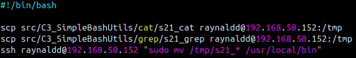

## Part 1. Настройка **gitlab-runner**

##### Подними виртуальную машину *Ubuntu Server 22.04 LTS*.


##### Скачай и установи на виртуальную машину **gitlab-runner**.


##### Запусти **gitlab-runner** и зарегистрируй его для использования в текущем проекте (*DO6_CICD*).


## Part 2. Сборка

##### Напиши этап для **CI** по сборке приложений из проекта *C3_SimpleBashUtils*.

Устанавливаю **make** и **gcc** на сервер с **gitlab-runner**:


Проверяю версии:


##### В файле _gitlab-ci.yml_ добавь этап запуска сборки через мейк файл из проекта _C3_.

Создаю в корне репозитория файл **gitlab-ci.yml** со следующей структурой:


После пуша коммита выполняется пайплайн со сборкой:


Логи сборки:


##### Файлы, полученные после сборки (артефакты), сохрани в произвольную директорию со сроком хранения 30 дней.


## Part 3. Тест кодстайла

#### Напиши этап для **CI**, который запускает скрипт кодстайла (*clang-format*).

Устанавливаю **clang-format** на сервер с **gitlab-runner**:


Проверяю версию:


##### Если кодстайл не прошел, то «зафейли» пайплайн.
##### В пайплайне отобрази вывод утилиты *clang-format*.

Обновленная структура файла **gitlab-ci.yml**:


После пуша коммита выполняется пайплайн с тестом кодстайла:


Логи тестом кодстайла:


## Part 4. Интеграционные тесты

#### Напиши этап для **CI**, который запустит интеграционные тесты.
##### Для проекта *C3_SimpleBashUtils* можешь взять свои уже написанные интеграционные тесты.
##### Запусти этот этап автоматически только при условии, если сборка и тест кодстайла прошли успешно.
##### Если тесты не прошли, то «зафейли» пайплайн.
##### В пайплайне отобрази вывод, что интеграционные тесты успешно прошли / провалились.

Обновленная структура файла **gitlab-ci.yml**:


После пуша коммита выполняется пайплайн с интеграционными тестами:


Логи тестов:


## Part 5. Этап деплоя

##### Подними вторую виртуальную машину *Ubuntu Server 22.04 LTS*.

Создал **prodserver** (клонировал **server** с генерацией новых MAC-адресов сетевых адаптеров) и запустил оба сервера:


Версия **Ubuntu** на **prodserver**:


Удалил **gitlab-runner** на **prodserver**:


#### Напиши этап для **CD**, который «разворачивает» проект на другой виртуальной машине.

##### Запусти этот этап вручную при условии, что все предыдущие этапы прошли успешно.

##### Напиши bash-скрипт, который при помощи **ssh** и **scp** копирует файлы, полученные после сборки (артефакты), в директорию */usr/local/bin* второй виртуальной машины.

Структура файла bash-скрипта **deploy.sh**:



Для того, чтобы копировать файлы при попомощи **scp** без ввода пароля генерирую пару ssh-ключей на сервере с **gitlab-runner** и копирую публичный ключ на **prodserver**:


Для того, чтобы на **prodserver** перемещать файлы из директории **/tmp** в директорию **/usr/local/bin** без ввода пароля добавляю в файл **/etc/sudoers** правило:

```
raynaldd ALL=(ALL:ALL) NOPASSWD: /usr/bin/mv /tmp/* /usr/local/bin
```


Файл **/etc/sudoers** изменен корректно:


##### В файле _gitlab-ci.yml_ добавь этап запуска написанного скрипта.

Обновленная структура файла **gitlab-ci.yml**:


После пуша коммита выполнется пайплайн с развертыванием:


Логи деплоя:


Проверяю наличие исполняемых файлов **s21_cat** и **s21_grep** на **prodserver**:


##### Сохрани дампы образов виртуальных машин.


## Part 6. Дополнительно. Уведомления

#### Настрой уведомления об успешном/неуспешном выполнении пайплайна через бота с именем «[твой nickname] DO6 CI/CD» в *Telegram*.

Создал телеграмм бота с помощью **@BotFather** c именем **raynaldd DO6 CI/CD**.

Для отправки отправки уведомлений создал bash-скрипт **tg_bot.sh**, в котором будет обращение к **API Telegram**:


Обновленная структура файла **gitlab-ci.yml**:


После пуша коммита выполнется пайплайн с рассылкой уведомлений:


Логи:


Уведомления в **Telegram**, содержащие информацию об успешности прохождения как этапа **CI**, так и этапа **CD**:


