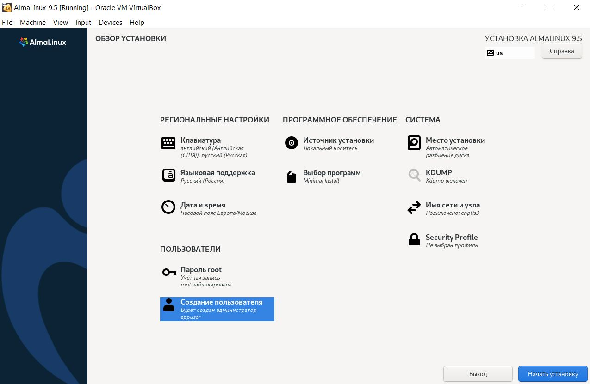
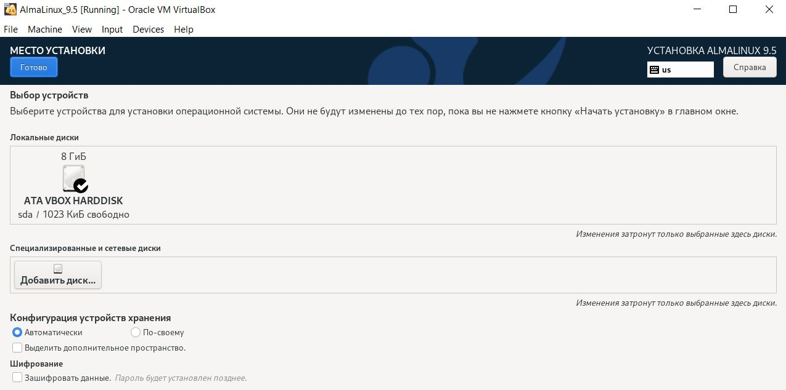
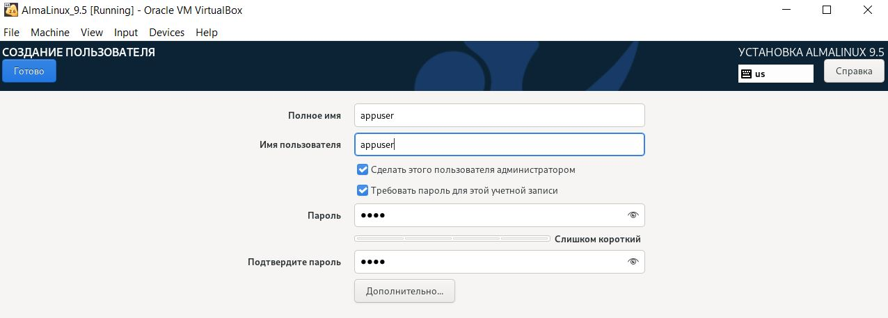
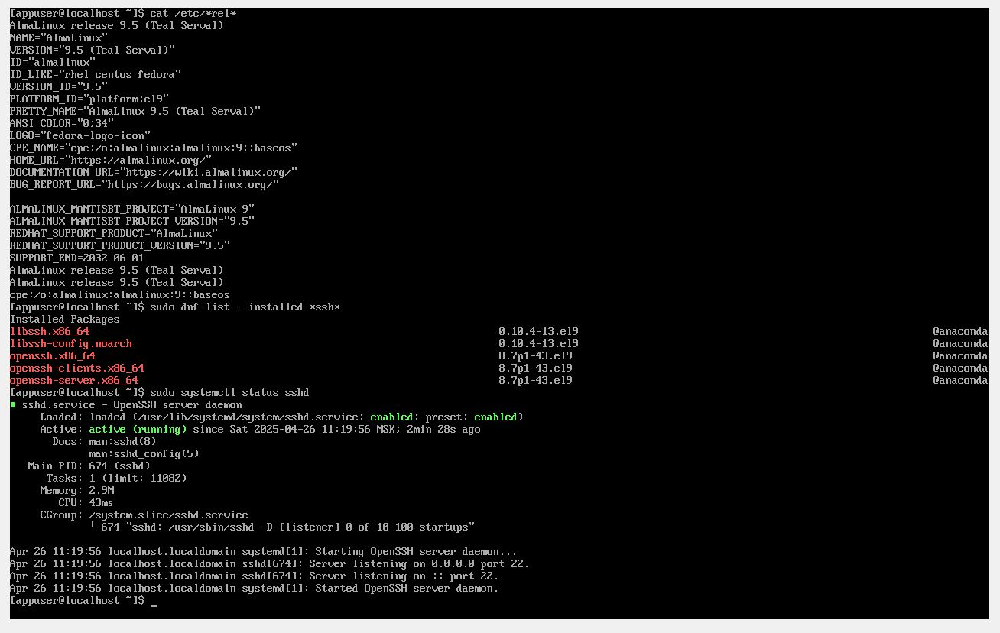
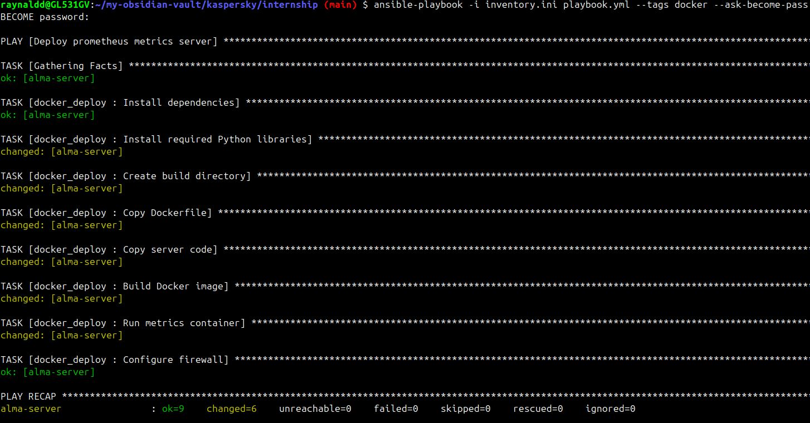

## Введение

Настоящий документ является структурированным отчетом с подробным описанием выполняемых действий в процессе решения задания. Выполнены основная часть и бонусное задание №1.

## Задание

Необходимо развернуть микросервис на виртуальной машине (ВМ), используя систему управления конфигурациями и описать выполненные действия.

1. В качестве гипервизора 2-го типа разрешается использовать любой, по своему усмотрению: VMware Workstation, VirtualBox, HyperV, Qemu, Vagrant и т.п. Операционная система для ВМ: RedHat-подобные системы, например, Rocky Linux, AlmaLinux и т.д.

2. Микросервис должен доставляться на виртуальную машину с помощью системы управления конфигурациями, после чего микросервис должен работать в фоне на ВМ. Необходимая CMS (Configuration Management Systems / Система Управления Конфигурациями): Ansible.

3. Микросервис: HTTP сервер, который экспортирует на 8080 порт Prometheus метрики. Одна из метрик должна предоставлять данные о том, на какой типе хоста запущен сервер: виртуальная машина, контейнер или физический сервер. Для написания можно использовать любой язык программирования (желательно, Python или Golang). Рекомендуется использовать готовые библиотеки для поднятия HTTP сервера и проброса Prometheus метрик.

4. В браузере на виртуальной машине по адресу http://localhost:8080 должны отображаться соответствующие Prometheus метрики.

## Бонусное задание 1

1. Адаптировать ansible-role и ansible-playbook также под альтернативный сценарий: запуск того же микросервиса в контейнере на той же ВМ.
2. В качестве CRI (Container Runtime Interface) использовать Docker или Podman.
3. Установку докера в ansible-role закидывать необязательно, можно выполнить руками заранее.

## Бонусное задание 2

1. Автоматизировать этап создания виртуальной машины из пункта 1 основного задания. Автоматизация должна включать в себя (1) создание виртуальной машины (2) установку ОС в виртуальной машине (3) настройку ОС в виртуальной машине (до этапа разворачивания микросервиса, но, по возможности, с автоматизацией установки и настройки CRI).
2. В качестве основы для автоматизации создания ВМ можно использовать любые языки программирования либо утилиты для реализации подхода Infrastructure as a Code (во втором случае предпочтительно Terraform). Если ВМ создается на платформе ОС Windows, то автоматизацию создания ВМ предпочтительно реализовать с использованием Powershell.

## Решение

### Part 1. Установка и настройка ВМ

Скачиваем образ **AlmaLinux OS 9.5 Minimal ISO** с официального сайта:

https://almalinux.org/get-almalinux/

Используя гипервизор VirtualBox, создаем ВМ со следующими параметрами:
- CPU - 2 шт.
- RAM - 2 ГБ
- ROM - 8 ГБ
- Network adapter - bridged adapter

Используя скачанный образ **AlmaLinux OS 9.5 Minimal ISO**, устанавливаем ОС на ВМ:






Устанавливаем **Ansible** на локальной хост-машине с ОС Linux (у меня это Ubuntu 24.04 LTS): 
```sudo apt install ansible -y```

На локальной хост-машине генерируем пару SSH-ключей:
```ssh-keygen -t ed25519```

Убеждаемcя, что на ВМ установлен и активен **openssh-server** :



Узнаем IP адрес ВМ, полученный по DHCP:


Копируем публичный ключ на ВМ:


Делаем snapshot ВМ.

## Part 2. Ansible

Создаем инвентарный файл Ansible **inventory.ini** со следующим содержимым:

```
# alias хоста соответствующий его ip адресу; имя пользователя, под которым Ansible будет подключаться; приватный SSH-ключ для подключения; повышенные привелегии; метод повышения привелегий

alma-server ansible_host=192.168.50.209 ansible_user=appuser ansible_ssh_private_key_file=~/.ssh/id_ed25519 ansible_become=yes ansible_become_method=sudo

```

Проверяем доступность ВМ через Ansible (нужно ввести пароль пользователя **appuser** для повышения привилегий):


На **AlmaLinux OS 9.5 Minimal** по-умолчанию установлена и запущена служба **firewalld**. Учтем это при написании Ansible playbook:


Создаем **Ansible playbook** со следующим содержимым:

```
---
- name: Deploy prometheus metrics server 
  hosts: alma-server                     
  vars:
    app_port: 8080                       
    app_dir: /opt/prometheus-metrics     

  tasks:
    # Установка зависимостей
    - name: Install dependencies         
      dnf:
        name:
          - python3                    
          - python3-pip                
        state: present                   

    # Установка библиотеки prometheus-client
    - name: Install prometheus-client   
      pip:
        name: prometheus-client          
        executable: pip3                

    # Создание директории для приложения
    - name: Create application directory
      file:
        path: "{{ app_dir }}"           
        state: directory                 
        mode: 0755                      
        owner: appuser                   
        group: appuser                   

    # Копирование кода сервера
    - name: Copy server code          
      copy:
        src: ./server.py                
        dest: "{{ app_dir }}/server.py"  
        mode: 0755                       
        owner: appuser                   
        group: appuser                  

    # Настройка firewalld для открытия порта приложения
    - name: Configure firewall for Prometheus port
      firewalld:
        port: "{{ app_port }}/tcp"       
        permanent: yes                   
        state: enabled                   
      notify: Reload firewall            

    # Развёртывание systemd-сервиса для приложения
    - name: Deploy systemd service        
      template:
        src: metrics.service.j2          
        dest: /etc/systemd/system/metrics.service  
        mode: 0644                       
        owner: root                     
        group: root                      
      notify: 
        - Reload systemd                 
        - Restart metrics service       

    # Запуск и автозапуск сервиса
    - name: Ensure metrics service is running  
      systemd:
        name: metrics                    
        state: started                   
        enabled: yes                    
        daemon_reload: yes               

  handlers:
    # Хендлер для перезагрузки конфигурации systemd
    - name: Reload systemd               
      systemd:
        daemon_reload: yes

    # Хендлер для перезапуска сервиса метрик
    - name: Restart metrics service      
      systemd:
        name: metrics
        state: restarted

    # Хендлер для перезагрузки firewalld после изменения правил
    - name: Reload firewall
      systemd:
        name: firewalld
        state: reloaded
```

Создаем **Jinja2-шаблон** Unit-файла службы metrics:

```
[Unit]
Description=Prometheus Metrics Server
After=network.target

[Service]
ExecStart=/usr/bin/python3 {{ app_dir }}/server.py
Restart=always
User=appuser
Group=appuser
WorkingDirectory={{ app_dir }}

[Install]
WantedBy=multi-user.target
```

## Part 3. HTTP-сервер

Код HTTP-сервера на Python:

```
import os  # Работа с операционной системой (файлы, пути и т.д.)
import time  # Работа со временем (задержки, таймеры)
from prometheus_client import (
    start_http_server,
    Gauge,
)  # Импорт функций и классов для Prometheus метрик
import platform  # Информация о платформе (ОС, архитектура)
import subprocess  # Запуск внешних системных команд
import sys  # Взаимодействие с интерпретатором Python (например, выход из программы)

# Создаем метрику типа Gauge с именем "host_type_info" и описанием.
# Метрика имеет метку "type", которая будет содержать тип хоста (physical, vm, container и т.д.)
HOST_TYPE = Gauge(
    "host_type_info", "Type of host where the server is running", ["type"]
)


def detect_host_type():
    """
    Определяет тип хоста, на котором запущено приложение:
    - container (контейнер)
    - vm (виртуальная машина)
    - physical (физический сервер)
    """

    # Проверяем наличие файла /.dockerenv - индикатор Docker-контейнера
    if os.path.exists("/.dockerenv"):
        return "container"

    # Пытаемся прочитать /proc/1/cgroup и проверить наличие признаков контейнеризации
    try:
        with open("/proc/1/cgroup", "r") as f:
            cgroup_content = f.read()
            # Если в содержимом встречаются ключевые слова, связанные с контейнерами
            if any(
                container_tech in cgroup_content
                for container_tech in ["docker", "lxc", "kubepods", "containerd"]
            ):
                return "container"
    except (IOError, FileNotFoundError):
        # Если файл не найден или ошибка чтения - игнорируем
        pass

    # Проверяем название продукта оборудования на признаки виртуализации
    try:
        with open("/sys/class/dmi/id/product_name", "r") as f:
            product_name = f.read().strip().lower()
            # Если в названии встречаются слова, указывающие на виртуализацию
            if any(
                vm_tech in product_name
                for vm_tech in ["vmware", "virtual", "kvm", "hvm", "xen"]
            ):
                return "vm"
    except (IOError, FileNotFoundError):
        pass

    # Анализируем содержимое /proc/cpuinfo на признаки виртуализации процессора
    try:
        with open("/proc/cpuinfo", "r") as f:
            cpuinfo = f.read().lower()
            if any(vm_flag in cpuinfo for vm_flag in ["hypervisor", "vmx", "svm"]):
                return "vm"
    except (IOError, FileNotFoundError):
        pass

    # Если система Linux, пытаемся определить виртуализацию через системные утилиты
    if platform.system() == "Linux":
        try:
            # Запускаем systemd-detect-virt, которая возвращает тип виртуализации или "none"
            virt_check = subprocess.run(
                ["systemd-detect-virt"],
                stdout=subprocess.PIPE,
                stderr=subprocess.PIPE,
                text=True,
            )
            if virt_check.returncode == 0 and virt_check.stdout.strip() != "none":
                return "vm"
        except (FileNotFoundError, subprocess.SubprocessError):
            # Если команда не найдена или ошибка - игнорируем
            pass

        try:
            # Запускаем virt-what, которая возвращает информацию о виртуализации
            virt_what = subprocess.run(
                ["virt-what"], stdout=subprocess.PIPE, stderr=subprocess.PIPE, text=True
            )
            if virt_what.returncode == 0 and virt_what.stdout.strip():
                return "vm"
        except (FileNotFoundError, subprocess.SubprocessError):
            pass

    # Если ни один из способов не выявил виртуализацию или контейнер - считаем физическим сервером
    return "physical"


def update_host_type_metric():
    """
    Обновляет метрику HOST_TYPE, устанавливая значение 1 для текущего типа хоста,
    и 0 для остальных.
    """

    host_type = detect_host_type()  # Определяем текущий тип хоста

    # Сбрасываем все метки к 0, чтобы не было "зависших" значений
    for type_name in ["physical", "vm", "container", "unknown"]:
        HOST_TYPE.labels(type=type_name).set(0)

    # Устанавливаем 1 для метки, соответствующей текущему типу хоста
    HOST_TYPE.labels(type=host_type).set(1)


def main():
    port = 8080  # Порт для HTTP-сервера метрик

    print(f"Starting Prometheus metrics server on port {port}")
    start_http_server(port)  # Запускаем HTTP-сервер Prometheus

    update_host_type_metric()  # Обновляем метрику с текущим типом хоста

    print(f"Server started successfully. Metrics available at http://localhost:{port}")
    print("Host type detected as:", detect_host_type())

    try:
        while True:
            time.sleep(60)  # Ждем 60 секунд, чтобы сервер продолжал работать
    except KeyboardInterrupt:
        # При нажатии Ctrl+C корректно завершаем работу
        print("Server shutting down")
        sys.exit(0)


# Запуск программы, если скрипт выполняется напрямую
if __name__ == "__main__":
    main()

```

## Part 4. Deploy

Запускаем **playbook.yml**:


Проверяем работу сервиса на ВМ:


Отправляем GET-запрос к веб-серверу с помощью **curl** и наблюдаем Prometheus метрики:


То же через текстовый браузер **lynx**:


## Part 5. Ansible role

Возвращаемся на сделанный ранее snapshot ВМ.

Создаем **Ansible role** для данной задачи:

```
ansible-galaxy init roles/service_deploy
```

Структура **roles/service_deploy**:


Обновленный **playbook.yml**:

```
---
- name: Deploy prometheus metrics server
  hosts: alma-server
  roles:
    - role: service_deploy
      tags: service
```

**roles/service_deploy/handlers/main.yml**:

```
---
# handlers file for roles/service_deploy
- name: Reload systemd
  systemd:
    daemon_reload: yes

- name: Restart metrics service
  systemd:
    name: metrics
    state: restarted

- name: Reload firewall
  systemd:
    name: firewalld
    state: reloaded
```

**roles/service_deploy/tasks/main.yml**:

```
---
# tasks file for roles/service_deploy
- name: Install dependencies
  dnf:
    name:
      - python3
      - python3-pip
    state: present

- name: Install prometheus-client
  pip:
    name: prometheus-client
    executable: pip3

- name: Create application directory
  file:
    path: "{{ app_dir }}"
    state: directory
    mode: 0755
    owner: appuser
    group: appuser

- name: Deploy application code
  copy:
    src: server.py
    dest: "{{ app_dir }}/server.py"
    mode: 0755
    owner: appuser
    group: appuser

- name: Configure firewall
  firewalld:
    port: "{{ app_port }}/tcp"
    permanent: yes
    state: enabled
  notify: Reload firewall

- name: Deploy systemd service
  template:
    src: metrics.service.j2
    dest: /etc/systemd/system/metrics.service
    mode: 0644
    owner: root
    group: root
  notify:
    - Reload systemd
    - Restart metrics service

- name: Ensure service is running
  systemd:
    name: metrics
    state: started
    enabled: yes
    daemon_reload: yes
```

**roles/service_deploy/vars/main.yml**:

```
---
# vars file for roles/service_deploy
app_port: 8080
app_dir: /opt/prometheus-metrics
```

Запускаем **playbook.yml**:


По аналогии с Частью 4 проверяем работу сервиса на ВМ, отправляем GET-запрос к веб-серверу с помощью **curl** и наблюдаем Prometheus метрики.

Делаем snapshot ВМ.

### Part 6. Bonus part 1. Docker

Устанавливаем и запускаем Docker Engine на ВМ вручную, используя инструкцию:

https://docs.docker.com/engine/install/rhel/

Добавляем пользователя **appuser** в группу **docker**:

```sudo usermod -aG docker appuser```

Проверяем работу сервиса на ВМ:


Делаем snapshot ВМ.

Останавливаем службу **metrics.service** на ВМ:

```sudo systemctl stop metrics```

Устанавливаем (обновляем) коллекцию на локальной хост-машине:

```
ansible-galaxy collection install --force community.docker
```

Создаем **Ansible role** для данной задачи:

```
ansible-galaxy init roles/docker_deploy
```

Структура **roles/docker_deploy**:


Обновленный **playbook.yml**:

```
---
- name: Deploy prometheus metrics server
  hosts: alma-server
  roles:
    - role: service_deploy
      tags: service
    - role: docker_deploy
      tags: docker
```

**roles/docker_deploy/files/Dockerfile**:

```
FROM python:3.9.22-alpine3.21
RUN adduser -D appuser && \
    mkdir /opt/prometheus-metrics && \
    chown -R appuser:appuser /opt/prometheus-metrics && \
    pip install prometheus-client
USER appuser 
WORKDIR /opt/prometheus-metrics
COPY --chown=appuser server.py .
EXPOSE 8080
CMD ["python", "server.py"]
```

**roles/docker_deploy/handlers/main.yml**:

```
---
# handlers file for roles/docker_deploy
- name: Reload firewall
  systemd:
    name: firewalld
    state: reloaded
```

**roles/docker_deploy/tasks/main.yml**:

```
---
# tasks file for roles/docker_deploy
- name: Install dependencies
  dnf:
    name:
      - python3
      - python3-pip
    state: present

- name: Install required Python libraries
  pip:
    name:
      - requests
    executable: pip3

- name: Create build directory
  file:
    path: "{{ build_context }}"
    state: directory
    mode: 0755

- name: Copy Dockerfile
  copy:
    src: Dockerfile
    dest: "{{ build_context }}/Dockerfile"
    mode: 0644

- name: Copy server code
  copy:
    src: server.py
    dest: "{{ build_context }}/server.py"
    mode: 0644

- name: Build Docker image
  docker_image:
    name: "{{ docker_image }}"
    source: build
    build:
      path: "{{ build_context }}"
    force_source: yes

- name: Run metrics container
  docker_container:
    name: "{{ docker_container }}"
    image: "{{ docker_image }}"
    state: started
    restart_policy: unless-stopped
    ports:
      - "{{ app_port }}:8080"
    volumes:
      - "/etc/localtime:/etc/localtime:ro"

- name: Configure firewall
  firewalld:
    port: "{{ app_port }}/tcp"
    permanent: yes
    state: enabled
  notify: Reload firewall
```

**roles/docker_deploy/vars/main.yml**:

```
---
# vars file for roles/docker_deploy
app_port: 8080
docker_image: "prometheus-metrics"
docker_container: "metrics-server"
build_context: "/opt/docker-build"
```

Запускаем **playbook.yml**:



Проверяем работу контейнера на ВМ:


Отправляем GET-запрос к веб-серверу с помощью **curl** и наблюдаем Prometheus метрики:


То же через текстовый браузер **lynx**:

