## Введение

Настоящий документ является руководством по развертыванию микросервиса на виртуальной машине как службу systemd и в Docker-контейнере, используя систему управления конфигурациями Ansible.

### Main part.  Развертывание сервиса на ВМ как службу systemd

Скачиваем образ **AlmaLinux OS 9.5 Minimal ISO** с официального сайта:

https://almalinux.org/get-almalinux/

Используя гипервизор VirtualBox, создаем ВМ со следующими параметрами:
- CPU - 2 шт.
- RAM - 2 ГБ
- ROM - 8 ГБ
- Network adapter - bridged adapter

Используя скачанный образ **AlmaLinux OS 9.5 Minimal ISO**, устанавливаем ОС на ВМ:

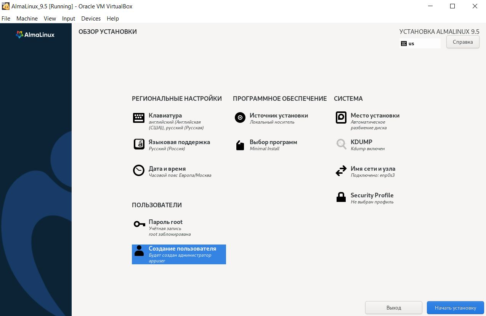
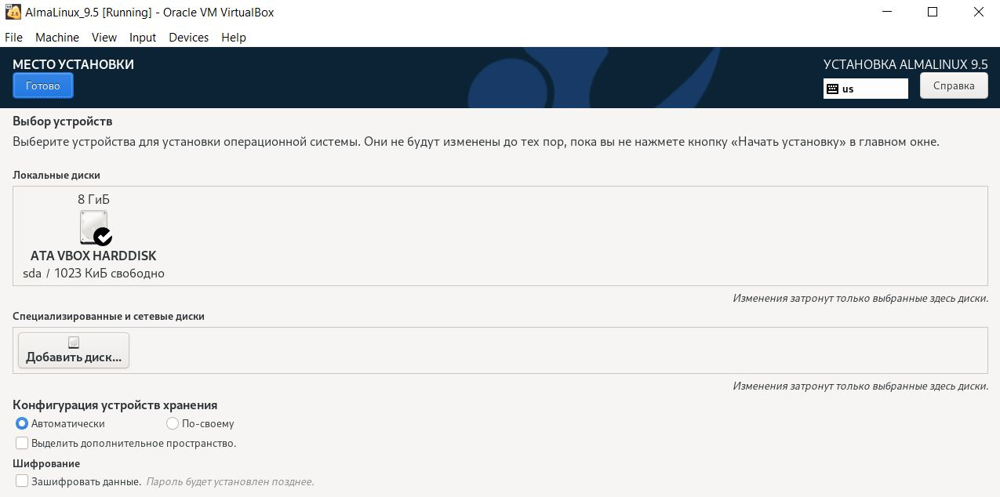
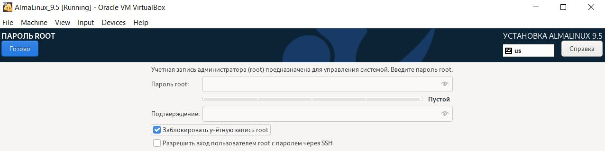
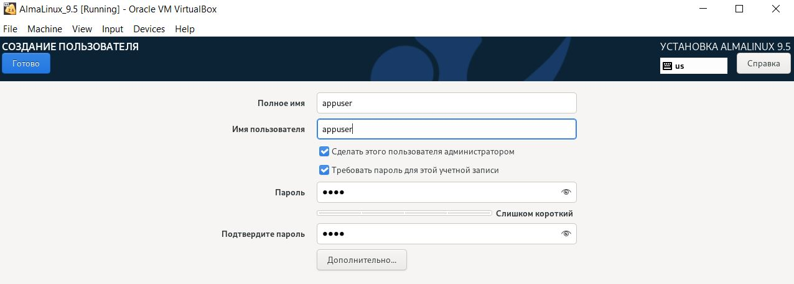

Устанавливаем **Ansible** на локальной хост-машине с ОС Linux (у меня это Ubuntu 24.04 LTS): 
```sudo apt install ansible -y```

На локальной хост-машине генерируем пару SSH-ключей:
```ssh-keygen -t ed25519```

Убеждаемcя, что на ВМ установлен и активен **openssh-server** :

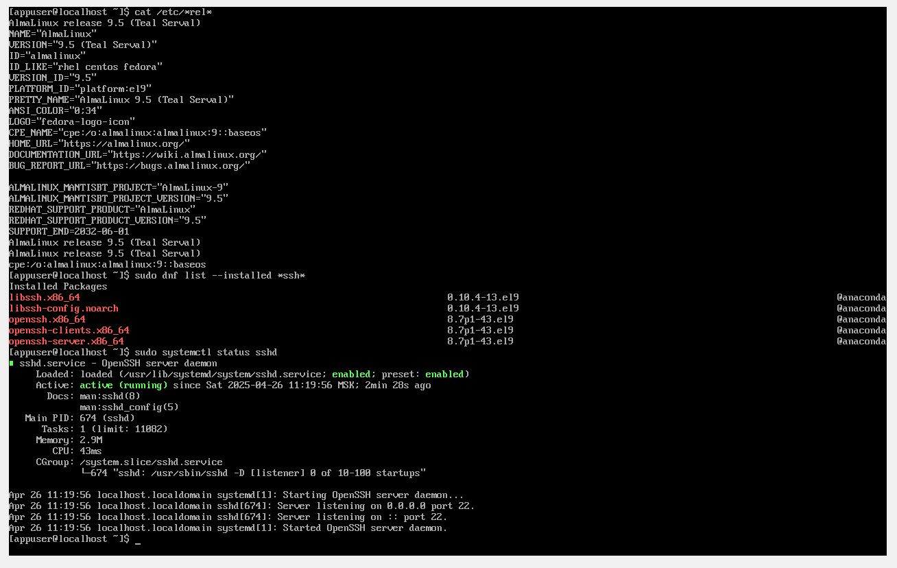

Узнаем IP адрес ВМ, полученный по DHCP:

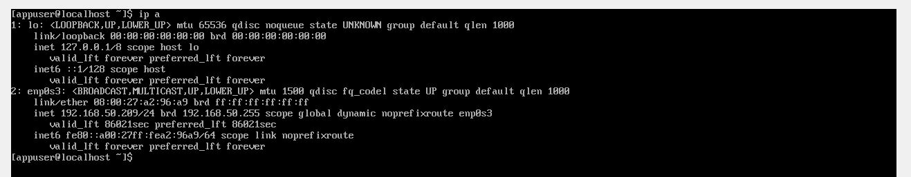

Копируем публичный ключ на ВМ:

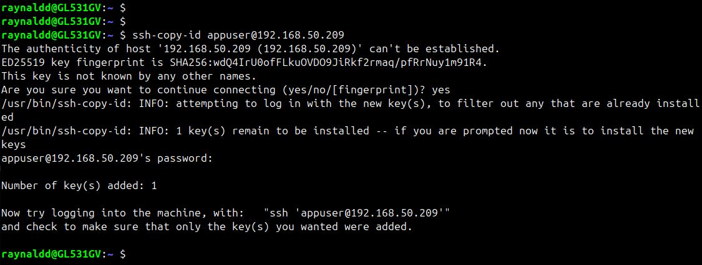

Проверяем доступность ВМ через Ansible (нужно ввести пароль пользователя **appuser** для повышения привилегий):

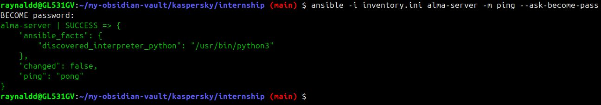

Запускаем **playbook.yml**:

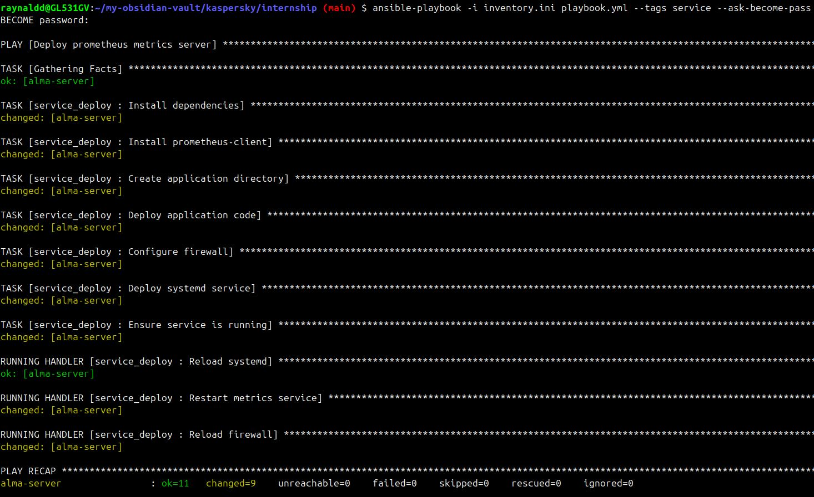

Проверяем работу сервиса на ВМ:

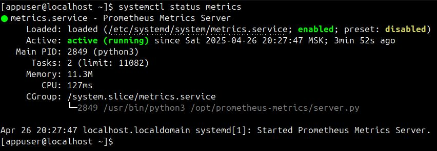

Отправляем GET-запрос к веб-серверу с помощью **curl** и наблюдаем Prometheus метрики:

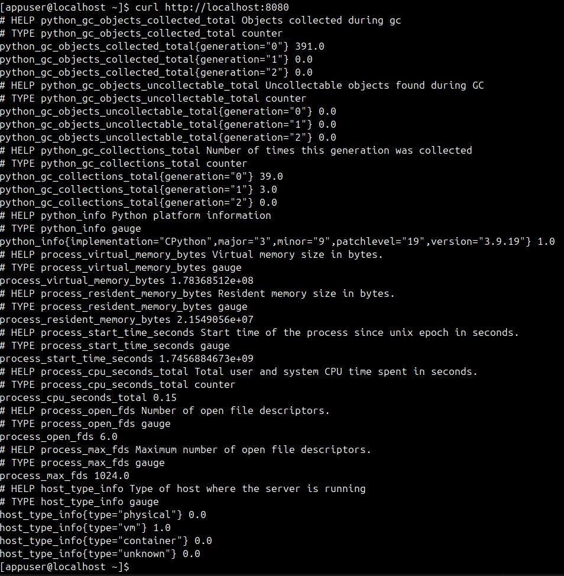

### Bonus part 1. Развертывание сервиса на ВМ в Docker-контейнере

Останавливаем службу **metrics.service** на ВМ:

```sudo systemctl stop metrics```

Устанавливаем и запускаем Docker Engine на ВМ вручную, используя инструкцию:

https://docs.docker.com/engine/install/rhel/

Добавляем пользователя **appuser** в группу **docker**:

```sudo usermod -aG docker appuser```

Проверяем работу сервиса на ВМ:

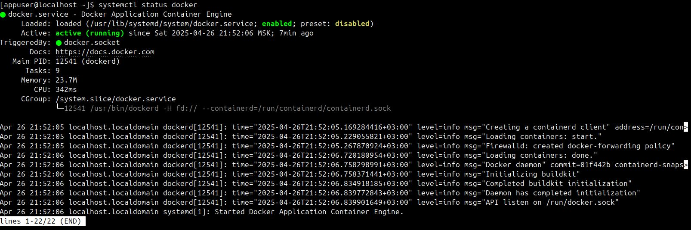

Устанавливаем (обновляем) коллекцию на локальной хост-машине:

```
ansible-galaxy collection install --force community.docker
```

Запускаем **playbook.yml**:

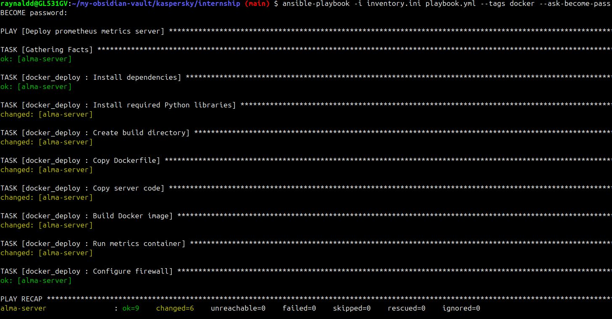

Проверяем работу контейнера на ВМ:

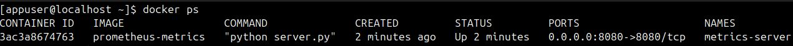

Отправляем GET-запрос к веб-серверу с помощью **curl** и наблюдаем Prometheus метрики:

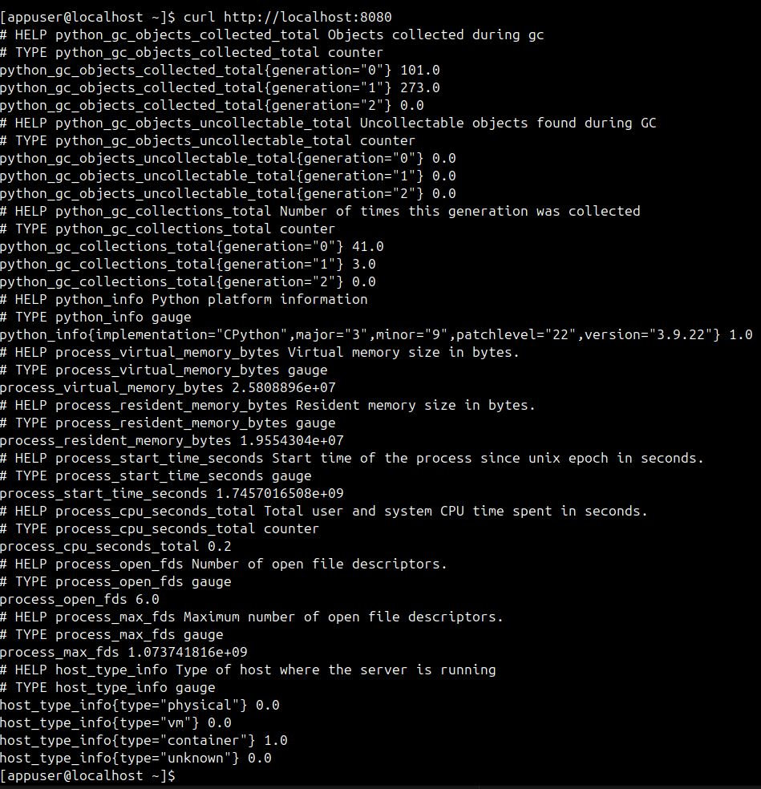